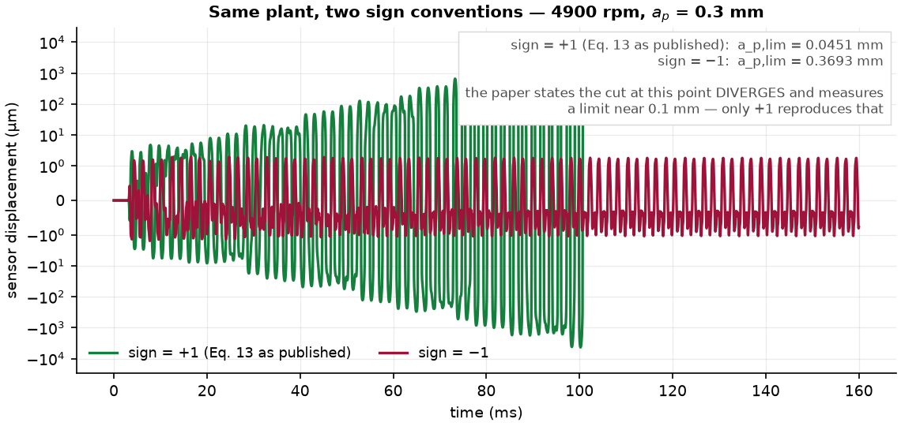
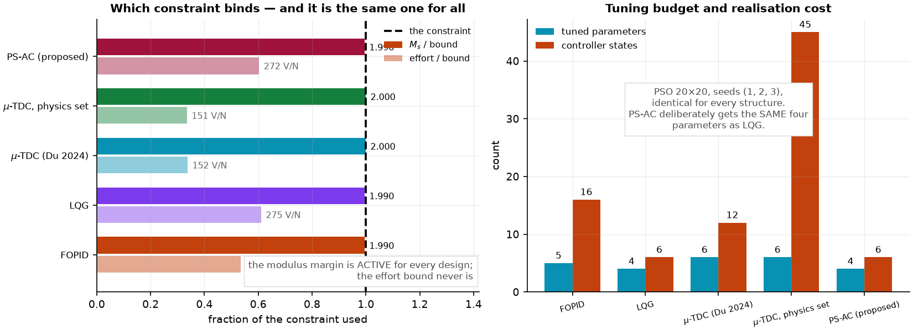
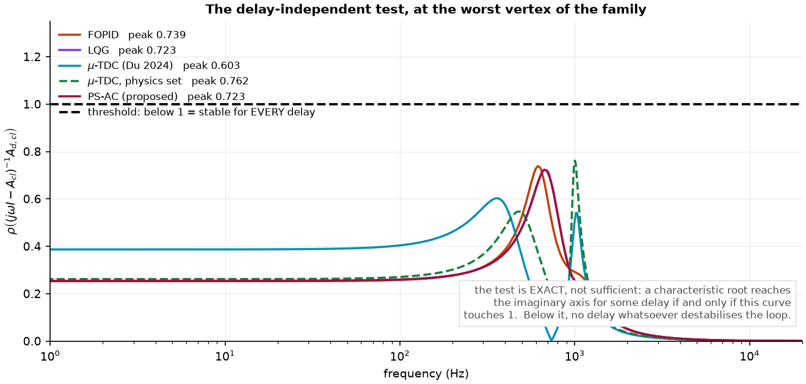
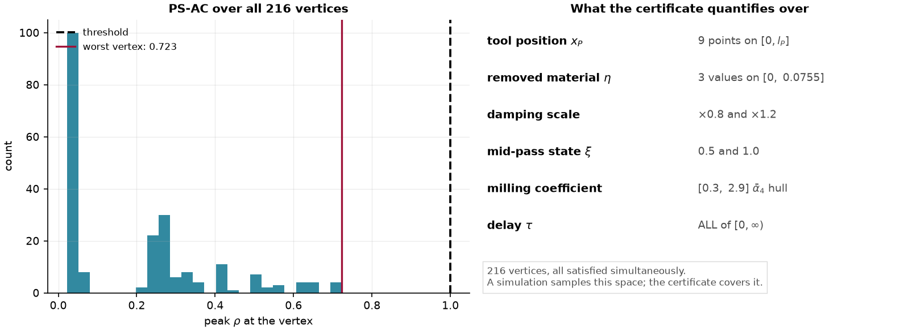
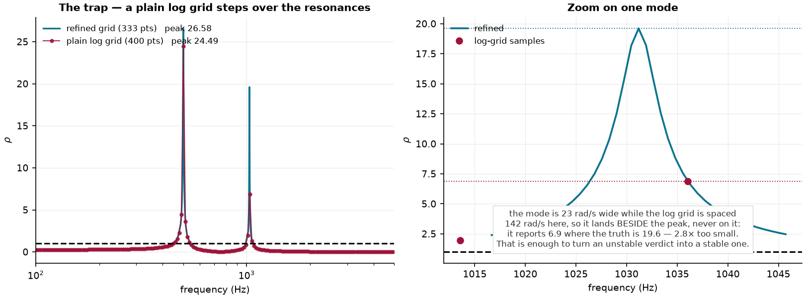
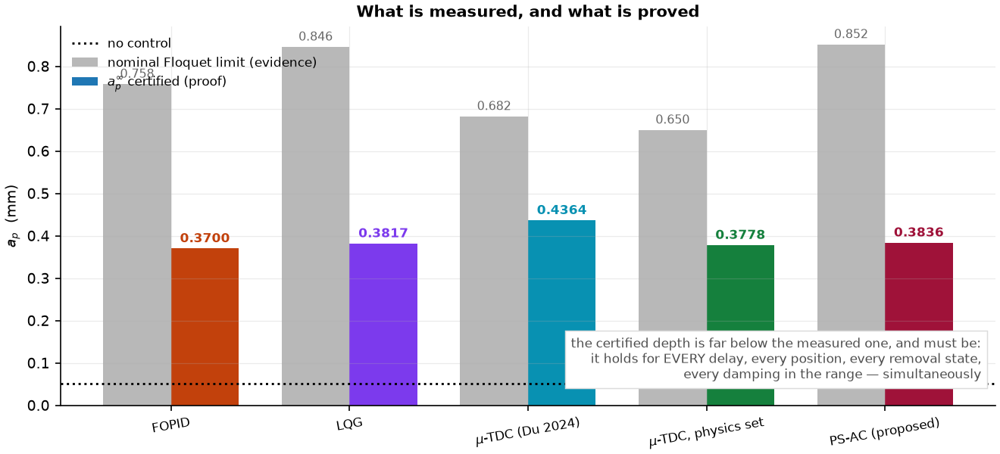
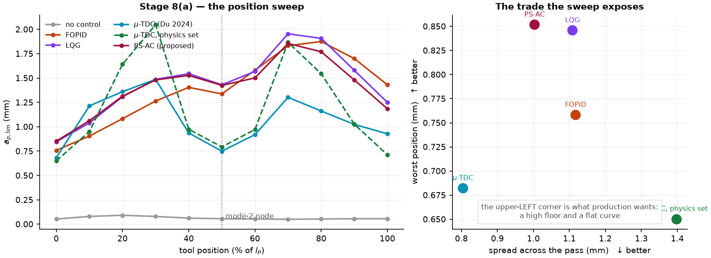
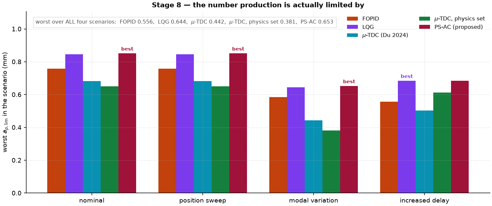

# تحكّم نشط مجدوَل على الموضع لقمع اهتزاز الفرز في القِطع الرقيقة، مع شهادة استقرار مستقلّة عن التأخير

**مسوّدة ورقة**

---

## ملخّص

في فرز القِطع رقيقة الجدران تعتمد ديناميكا المنظومة على **موضع الأداة على الحافّة**، لأن
قوّة القطع التجديدية تدخل عبر الشعاع النمطي $D(x_P)$ وحده. تعالج الأعمال المتينة المنشورة
هذا التغيّر بوضعه في **صندوق عدم يقين**. غير أنّ $x_P$ ليس مجهولًا: المكنة هي التي تأمر
التغذية، فتعرفه في كل لحظة. تقترح هذه الورقة الاستفادة من ذلك مباشرةً بقانون تحكّم
$u(t) = -K(x_P)\hat{x}(t)$، حيث يُصمَّم $K$ عند كل موضع على نموذج **يتضمّن صلابة القطع
الاسمية عند ذلك الموضع** بدل دفعها إلى صندوق.

يُبنى العمل كلّه على منظومة Du وزملائه (2024) بعد إعادة إنتاجها والتحقّق منها على أربعة
مستويات مستقلّة، ويُقارَن المتحكّم المقترح بـFOPID وLQG وبالمتحكّم المنشور
(‏μ-synthesis + تحكّم بالتأخير) تحت **بروتوكول واحد**: نفس المنظومة والمشغِّل والحسّاس
وشروط القطع ودالة الهدف والقيود والمُحسِّن والبذور.

النتائج: المتحكّم المقترح يرفع حدّ القطع المستقرّ من $0.0503$ إلى $0.8517$ mm — أي
**16.9 ضعفًا** — بأربعة بارامترات وبجهد ذروته $38$ V، ويعطي **أدنى تشتّت** للحدّ عبر
الممرّ ($1.003$ mm مقابل $1.109$ لـLQG) و**أفضل أسوأ حالة** في السيناريوهات الأربعة
($0.653$ mm). وتُقدَّم إلى جانب ذلك **شهادة استقرار مستقلّة عن التأخير** — يخلو منها
المرجع — مبنيّة على اختبار عبور طيفي **مضبوط لا كافٍ فقط**، تُثبت أنّ الحلقة تصمد
لـ**كل** تأخير تجديدي عند عمق مضمون $a_p^\infty = 0.3836$ mm وعند توسيعٍ لمجموعة عدم
اليقين بمعامل $\delta_{\max} = 1.40$.

المكسب على LQG **صغير ومتّسق لا مذهل**: $+0.7\%$ على الحدّ الأدنى و$-9.5\%$ على التشتّت
بنفس عدد البارامترات. وأكبره في **تجانس الأداء**، وهو المفيد هندسيًّا لأن الإنتاج يحدّه
أسوأ موضع لا متوسّطها.

ثم يُبنى فوق ذلك بحثٌ مُوجَّه بخريطة الإخفاق ينتهي إلى **PS‑TDC‑R** (القانون المجدوَل +
متحكّمة التأخير فوق قاعدةٍ تُصمَّم عند غلاف معامل القطع): أفضل أرضية في الدراسة
($0.9307$ mm، $+9.3\%$)، مع **شهادة Lyapunov–Krasovskii** التي يفتقدها المتحكّم
المنشور، و**أول $\mu_{RS} < 1$** — على الفيزياء البارامترية والموضعُ جدولةً
($0.736$ شاملًا خطأ الاستيفاء). ويُثبَت بنيويًّا أن هامشَي العبور المُصادَقين يبقيان
للمتحكّم المنشور: لا زوج تأخير فوق القاعدة المجدوَلة يبلغهما (مسح 627 نقطة)، وأنّ ما
يحجب $\mu_{RS} < 1$ الكامل عن **كل** التصاميم هو كتلة المشغِّل عند $4$ kHz لا الموضع
ولا الفيزياء.

**كلمات مفتاحية:** فرز الجدران الرقيقة، الاهتزاز التجديدي، التحكّم النشط، الجدولة على
متغيّر معلوم، أنظمة ذات تأخير، شهادة استقرار، پيزوكهربائي.

---

## 1. مقدّمة

قمع الاهتزاز التجديدي (‏chatter) في فرز القِطع رقيقة الجدران مسألةٌ يتقاطع فيها أمران:
مرونةُ القطعة نفسها، وتغيّرُ ديناميكا القطع مع تقدّم الأداة. وقد عالجت أعمالٌ عديدة الأولى
بالتحكّم النشط عبر مشغّلات پيزوكهربائية، وعالجت الثانية غالبًا بوضع التغيّر في
**صندوق عدم يقين** ثم التركيب المتين عليه.

يقوم عمل Du وزملائه [1] على هذا النهج: نموذج Chebyshev–Ritz للوحة، ومشغِّل پيزو، وتأخير
تجديدي، ثم تركيب $\mu$ مع متحكّمة بالتأخير. وفيه تُوصَف الديناميكا المعتمِدة على الموضع
بمجموعة عدم يقين معطاة بالمعادلات (22)–(25).

**الملاحظة التي تنطلق منها هذه الورقة بسيطة:** موضع الأداة $x_P$ **ليس مجهولًا**. المكنة
تأمر التغذية، فالموضع معلوم بدقّة في كل لحظة. ووضعُ متغيّر **معلوم** في صندوق عدم يقين
هو إهدارٌ للمعلومة: يُجبِر المتحكّم على أن يكون متينًا تجاه تغيّرٍ يستطيع أن **يتتبّعه**.

فالمساهمة هنا:

1. **قانون تحكّم مجدوَل على الموضع** $u(t) = -K(x_P)\hat{x}(t)$، مصمَّم عند كل موضع على
   نموذج يتضمّن صلابة القطع الاسمية هناك — بنفس بنية LQG و**نفس عدد البارامترات**، فالفرق
   سطر واحد في نموذج التصميم لا حرّية ضبط إضافية.
2. **شهادة استقرار مستقلّة عن التأخير** على كامل مجال الموضع وعائلة عدم اليقين، مبنيّة على
   اختبار عبور **مضبوط**، مع هامشَي عدم يقين وتأخير مُقاسَين لا مُدَّعَيَين.
3. **مقارنة تحت بروتوكول واحد** مع FOPID وLQG والمتحكّم المنشور، وأربعة سيناريوهات وستّة
   مقاييس، مع **إفصاح صريح** عن المواضع التي لا يتفوّق فيها المتحكّم المقترح.

### 1.1 ما ليس مساهمةً هنا

النموذج الميكانيكي كلّه من [1] ولم يُغيَّر: اللوحة، والمشغِّل، ونموذج القوّة، والتأخير.
والمقارنة كلّها مشروطة باصطلاح الإشارة المُثبَت في §2.3. وأي رقم يخصّ متحكّم $\mu$ هو
رقمُ **إعادة بناء** لا استنساخ، لأن المرجع لا ينشر أوزان التركيب ولا مكسبَي متحكّمته
ذات التأخير.

---

## 2. المنظومة المُصادَقة

### 2.1 النموذج

اللوحة $100\times80\times4$ mm من AL6061، مثبَّتة من حافّة واحدة، منمذَجة بطريقة
Chebyshev–Ritz ($P_X = P_Z = 14$)، مع رقعة پيزو QDA60‑20‑0.7. وبعد الاختزال النمطي:

$$
M_P\ddot q + C_P\dot q + \big(K_P + \alpha_4(t)\,D_P^\top D_P\big)q(t)
- \alpha_4(t)\,D_P^\top D_P\, q(t-\tau) = \alpha_3(t)\,D_P^\top f_\tau + H_{Pe}\,u(t)
$$

حيث $\tau = 60/(N_T\,\Omega)$ دور السنّ، و$\alpha_3, \alpha_4$ معاملا القطع الدوريّان غير
الملساوين، و$D_P = D(x_P)$ الشعاع النمطي عند موضع الأداة، و$H_{Pe}$ اقتران الرقعة.

### 2.2 التحقّق

أُعيد إنتاج المنظومة وحُقِّق منها على **أربعة مستويات مستقلّة**، كلٌّ منها يصادق شيئًا
مختلفًا (الشكل v1، v3):

| المستوى | ما يصادقه | الفارق عن [1] |
|---|---|---|
| التواترات الذاتية | الكتلة والصلابة | $-2.89 \dots -2.99\%$ |
| اللارنينات (‏731.2 / 2123.7 / 3008.3 Hz) | أشكال الأنماط، بمعزل عن المعايرة | — |
| ‏$D^\top D$ على الحافّة (الشكل 7 في [1]) | الاعتماد المكاني كاملًا | $< 3.7\%$ |
| دور السنّ ومدّة الممرّ | قانون القطع والتغذية | $< 0.1\%$ |

خطأ التواترات **منتظم الإشارة والمقدار على الأنماط الخمسة**، وهذا بذاته دليل: خطأٌ في
أشكال الأنماط كان سيغيّر إشارته بين نمط وآخر؛ أمّا الإزاحة المنتظمة فتدلّ على حدّ صلابة
عامّ مفقود. واللارنينات تصادق الأشكال **بمعزل تامّ** عن أي معايرة تواترية.

![**الشكل v1.** التواترات الذاتية الخمس مقابل الجدول 4 في [1]، والبواقي إلى جانبها. الخطأ **منتظم الإشارة على الأنماط الخمسة** — وهذا توقيع حدّ صلابة عامّ مفقود، لا خطأ في أشكال الأنماط، إذ كان خطأ الأشكال سيقلب إشارته بين نمط وآخر.](../../results/figures_model/fig_v1_frequencies.png)

![**الشكل v3.** الشكل 7 من [1] مُعادًا إنتاجه: عناصر $D^\top D$ على طول الحافّة العليا. النمط الثاني يمرّ **بعقدة** عند المنتصف، فيسقط الحدّ التجديدي هناك؛ والمصفوفة **رتبتها واحد عند كل موضع** ($|\det| \le 1.8\times10^{-15}$ مقابل مقياس عنصرٍ $3.81$). واللوحة الثانية تقارن كل عنصر بقراءة الشكل المنشور.](../../results/figures_model/fig_v3_dtd.png)

### 2.3 اصطلاح الإشارة

الاصطلاحان الممكنان في المعادلة (13) من [1] **ليسا متكافئين**:

| الاصطلاح | حدّ الاستقرار (mm) | زمن التباعد | يطابق [1]؟ |
|---|---|---|---|
| $+1$ (كما نُشرت) | $0.0393$–$0.0451$ | $0.107$ s | نعم |
| $-1$ | $0.330$–$1.350$ | لا يتباعد | لا |

يقول [1] صراحةً إنّ القطع عند نقطة التشغيل **يتباعد** وإنّ الحدّ التجريبي $\approx 0.1$ mm.
فالاصطلاح $+1$ هو الوحيد المتّسق مع ذلك، وكل نتائج هذه الورقة تستعمله (الشكل v5).



---

## 3. صياغة التحكّم النشط

بإدخال دخل الپيزو وكتابة الحالة $x = [q;\ \dot q]$:

$$
\dot x(t) = A(x_P)\,x(t) + A_d(x_P,t)\,x(t-\tau) + B\,u(t) + E(x_P)\,F(t)
$$

$$
A(x_P) = \begin{bmatrix} 0 & I \\ -M^{-1}\!\big(K + \alpha_{40} D^\top\! D\big) & -M^{-1}C \end{bmatrix},
\qquad
A_d = \begin{bmatrix} 0 & 0 \\ M^{-1}\alpha_4(t) D^\top\! D & 0 \end{bmatrix}
$$

$$
B = \begin{bmatrix} 0 \\ M^{-1}H_{Pe}\end{bmatrix},\qquad
E(x_P) = \begin{bmatrix} 0 \\ M^{-1}D^\top(x_P)\end{bmatrix},\qquad
y = D_{obs}\,q
$$

هذه الصياغة **مشتركة لكل المتحكّمات**؛ ولا يُسمح لأي متحكّم بنموذج منظومة مختلف.

**موضع الرقعة.** المرجع يتناقض بين قسمَيه (الزاوية اليسرى في القسم 3، واليمنى في القسم 5).
الاصطلاحان غير متكافئين: في الزاوية اليمنى تكون جداءات $D_{obs}(i)\,H_{Pe}(i)$ **بنفس
الإشارة** لكل الأنماط (المجموع $-4.47$، أي زوج مشغِّل/حسّاس مزدوج)، وفي اليسرى تتناوب
(المجموع $+0.305$). ووحدها الزاوية اليمنى — وهي التي أُجريت عندها تجارب المرجع — تسمح
لتغذية راجعة سرعيّة بتخميد كل الأنماط معًا. لذا تُعتمَد هنا.

---

## 4. المتحكّمات المرجعية والبروتوكول

### 4.1 المتحكّمات

- **FOPID**: $u = K_p e + K_i D^{-\lambda}e + K_d D^{\mu}e$، بتحقيق Oustaloup. خمسة بارامترات.
- **LQG**: مُنظِّم تربيعي + مُرشِّح كالمان، بمصفوفة ضجيج العملية
  $W = \mathbb{E}_x\!\left[E(x)E(x)^\top\right]$. أربعة بارامترات.
- **‏μ-TDC** [1]: متحكّم $\mu$ بتكرار D‑K، زائد المتحكّمة ذات التأخير للمعادلة (30).
  المبحوث فعليًّا **خمسة**: ثلاثة أوزان ($k_f$، $k_u$، $f_c$) على شبكة 60 نقطة، ومكسبان
  بـPSO. ويُحتسب في الجداول **ستّة** — بعدّ بارامترات الأوزان أربعة — وهو عدٌّ **في صالح
  المرجع** لا ضدّه، فلا يُنقِص من الفارق المُبلَّغ.

### 4.2 البروتوكول

القاعدة غير القابلة للتفاوض: **كل شيء مشترك إلا بنية المتحكّم**.

| العنصر | القيمة |
|---|---|
| نقطة التشغيل | 4900 rpm، $a_p = 0.3$ mm، $a_e = 0.1$ mm، $f_z = 0.02$ mm/سنّ، فرز هابط |
| دالة الهدف | $J = -\overline{\max_x \log\rho}$ على أعماق سبر $\{0.3, 0.6, 1.0\}$ mm |
| القيود | $M_s \le 2$، الجهد $\le 450$ V/N، أقطاب الحلقة الاسمية $\le -1$ s$^{-1}$ |
| المُحسِّن | PSO ‏$20\times20$، بذور $(1,2,3)$ — **مطابق لكل بنية** |
| التقييم | فلوكيه بالتقطيع الكامل، $m = 120$، نموذج خمسة أنماط |
| المحاكاة | $n_{sub} = 656$ خطوة لكل دور سنّ، تشبّع $\pm450$ V |

**تحقّق البروتوكول** (الشكل c2، c6): هامش المقياس **فعّال للجميع** ($1.990$–$2.000$)،
وحدّ الجهد **لم يُلزِم أبدًا** (‏34–61 % مستعمَل). فالقيد المُلزِم واحد، ولم يَنَل أيُّ
متحكّم سلطةً أكبر من الآخر.



**خطوة الزمن.** عند $n_{sub} = 164$ (‏40 kHz) تتباعد **كل** المتحكّمات زمنيًّا لأن أقطاب
Oustaloup تصل إلى 100 kHz فتنطوي؛ وعند 656 تختفي المشكلة تمامًا. هذا خطأ عدديّ لا فيزيائي،
ويُذكَر لأنّ كل مقاييس التردّد تبدو سليمة بينما الدمج يتباعد.

---

## 5. المتحكّم المقترح: تحكّم نشط مجدوَل على الموضع (PS‑AC)

### 5.1 الفجوة والقانون

الاعتماد المكاني يدخل من باب **واحد**: الشعاع $D(x_P)$. والنمط الثاني يمرّ **بعقدة** عند
منتصف الحافّة، فيتغيّر الحدّ التجديدي بمعامل $3.2$ على الطول (الشكل v3). المتحكّم الثابت
يهدر عدوانه حيث لا يلزم، ويعوزه حيث يلزم.

وبما أنّ $x_P$ **معلوم**، فالقانون المقترح:

$$
\boxed{\ u(t) = -K(x_P)\,\hat{x}(t)\ }
$$

مع نموذج تصميم عند كل موضع **يتضمّن صلابة القطع الاسمية هناك**:

$$
A(x) = \begin{bmatrix} 0 & I \\ -M^{-1}\big(K + \alpha_{40}\,D^\top(x)D(x)\big) & -M^{-1}C \end{bmatrix}
$$

ويُحسَب $K(x)$ على شبكة مواضع ويُستوفى بينها. وخلال دور سنّ واحد تتقدّم الأداة $0.02$ mm،
فالمكسب مجمَّد فعليًّا على مدى التأخير.

### 5.2 قرار تصميم: يُجدوَل المكسب وحده

جُرِّبت ثلاث نسخ: جدولة $K$ وحده، وجدولة المُراقِب وحده، وجدولتهما معًا. والنسختان
المجدوَلتا المُراقِب تبدوان الأفضل — فجدولة $K$ و$L$ معًا تعطي **أفضل حدّ اسمي**
($0.8927$) وأدنى تشتّت ($0.661$) — ثم **تنهاران كلتاهما إلى الصفر** عند انخفاض
التواترات $9.5\%$.

والعطل ليس في استقرار القطع بل في **استقرار الحلقة الاسمية نفسها**. فعند منتصف الحافّة،
وتحت الصندوق نفسه، و**بلا قطع إطلاقًا**:

| النسخة | $\max\mathrm{Re}$ (أقطاب الحلقة، بلا قطع) |
|---|---|
| LQG الثابت | $-93.62$ s$^{-1}$ |
| $K(x_P)$ وحده — القانون المقترح | $-93.37$ s$^{-1}$ |
| $L(x_P)$ وحده | $+2.99$ s$^{-1}$ ❌ |
| $K$ و$L$ معًا | $+8.47$ s$^{-1}$ ❌ |

والسبب مكانيّ: عند منتصف الحافّة يمرّ النمط الثاني بعقدة، فتصير النسبة
$|D_2|/|D_1| = 1.1\times10^{-2}$ ويصير اتجاه الاضطراب المفترَض
$E(l_P/2) \approx [0;\ D_1;\ 0]$ — بلا أي معلومة عن النمط الثاني. فيمنحه المُرشِّح
المجدوَل مكسبَ تقديرٍ شبه معدوم، وخطأٌ تواتري بـ$9.5\%$ يكفي لزعزعة حلقة التقدير.
أمّا المُرشِّح الثابت فمكسبه مبنيّ على $\bar W$ ولا يصفّر النمط الثاني عند أي موضع
(‏`results/observer_collapse.txt`).

**لذلك القانون المُعتمَد يجدوِل المكسب وحده.** وهذا قيدٌ مُستنتَج من تجربة، لا اختيار
تجميلي.

### 5.3 البارامترات

يأخذ PS‑AC **نفس** بارامترات LQG الأربعة عمدًا، فالمقارنة بينهما بين تصميمين
**بحرّية ضبط متطابقة**، لا يختلفان إلا في النموذج الذي صُمِّم عليه كلٌّ منهما:

$$
\log_{10} q_{pos} = 18.80,\quad \log_{10} q_{vel} = 4.40,\quad
\log_{10} r = -10.01,\quad \log_{10}\gamma = 10.47
$$

بـ$M_s = 1.990$ وجهدٍ $272$ V/N ورتبة $6$.

---

## 6. تحليل الاستقرار والمتانة

### 6.1 لماذا لا يكفي شرط $\mu$

المعادلة (16) في [1] تدفن الحدّ المتأخّر داخل الدخل، فشرط $\mu$ في المعادلة (28) هو شرط
لنظام **بلا تأخير**. ولا يوجد في الورقة كلّها شرط استقرار مع التأخير.

### 6.2 الشرط المُستعمَل: اختبار عبور مضبوط

للحلقة المغلقة المجمَّدة المعاملات $\dot x = A_{cl}x(t) + A_{d,cl}x(t-\tau)$، تعبر جذور
المعادلة المميّزة المحورَ التخيّلي لتأخيرٍ ما **إذا وفقط إذا**

$$
\sup_{\omega \ge 0}\ \rho\!\left((j\omega I - A_{cl})^{-1}A_{d,cl}\right) \ \ge\ 1
$$

وعندها $\tau_{\max} = \min_{\omega,k}\ \arg\lambda_k(\omega)/\omega$. **هذا شرط ضروري
وكافٍ**، لا شرط كافٍ فقط كشروط Lyapunov–Krasovskii المعتادة (الشكل k1).

ويُفرَض على **عائلة رؤوس** تغطّي: 9 مواضع، و3 قيم لإزالة المادة $\eta \in [0, 0.0755]$،
وتخميدَين ($\times0.8$، $\times1.2$)، وحالتَي منتصف الممرّ، وغلاف معامل القطع
$[0.3, 2.9]\bar\alpha_4$ — **216 رأسًا** تُستوفى معًا (الشكل k5).





### 6.3 فخّ عددي يجب ذكره

عند $\zeta \approx 0.003$ يبلغ عرض الرنين الذي تحمله الذروة $21$ rad/s عند $506$ Hz،
بينما تباعد شبكة لوغاريتمية بـ400 نقطة عنده $70$ rad/s — أوسع **3.3×**. فتسقط العيّنات
**بجانب** الذروة لا عليها: عند
$x_P = 75$ mm و$\alpha_4 = 2.9\,\bar\alpha_4$ تُبلِّغ الشبكة المستوية $\rho = 6.96$
بينما القيمة الحقيقية $21.47$ — أصغر **3.1×**. وهذا وحده يكفي لقلب حكمٍ بعدم الاستقرار
إلى استقرار. لذلك تُصقَل الشبكة حول **كل** قيمة ذاتية للحلقة المغلقة؛ والقيمة المصقولة هي
عينها القيمة المُقارَبة عند تكثيف الشبكة خمسين ضعفًا، أي أنها ليست تخمينًا آخر
(‏`results/grid_trap.txt`، الشكل k2).



### 6.4 النتائج المُصادَقة

| المتحكّم | $\rho_{peak}$ | $\tau_{\max}/\tau_0$ | $a_p^\infty$ mm | $\delta_{\max}$ |
|---|---|---|---|---|
| بلا تحكّم | 33.226 | 0.00 | 0.0108 | 0.00 |
| FOPID | 0.739 | $\infty$ | 0.3700 | 1.48 |
| LQG | 0.723 | $\infty$ | 0.3817 | 1.41 |
| ‏μ-TDC [1] | 0.603 | $\infty$ | **0.4364** | **1.54** |
| **PS‑AC** | 0.723 | $\infty$ | 0.3836 | 1.40 |

كل المتحكّمات تبلغ $\rho_{peak} < 1$، أي **تصمد لكل تأخير تجديدي مهما كان** — بينما
الحلقة المفتوحة عند $33.2$ تعبر عند $\tau \to 0$. والعمق المضمون **‏45 %** من المقيس
($0.3836$ مقابل $0.8517$)، ويجب أن يكون كذلك: هو يصمد لكل تأخير وكل موضع وكل حالة إزالة
وكل تخميد **في آنٍ واحد** (الشكل k3).

**‏μ-TDC المرجعي هو الأعلى في هذين المقياسين**، ويُذكَر ذلك صراحةً.



---

## 7. المقارنة العددية

### 7.1 السيناريو الاسمي

| المتحكّم | بار. | $a_{p,lim}$ أدنى | متوسّط | $A_{max}$ μm | $A_{RMS}$ μm | $T_s$ ms | $E_u$ V²s | $u_{max}$ V |
|---|---|---|---|---|---|---|---|---|
| بلا تحكّم | 0 | 0.0503 | 0.0614 | يتباعد | 634.5 | — | 0 | 0 |
| ‏μ-TDC [1] | 6 | 0.6821 | 1.0056 | 3.084 | 0.656 | 90.3 | 673.7 | **24.6** |
| FOPID | 5 | 0.7581 | 1.3209 | 2.093 | 0.399 | 5.4 | **524.4** | 35.1 |
| LQG | 4 | 0.8459 | **1.3811** | **1.996** | **0.360** | 5.4 | 635.5 | 37.9 |
| **PS‑AC** | 4 | **0.8517** | 1.3425 | 1.999 | 0.361 | 5.4 | 626.8 | 38.0 |

**لا متحكّم يفوز بالمقاييس الستّة.** ‏μ-TDC هو الأدنى جهدَ ذروة ($24.6$ V، والأدنى
طاقةً هو FOPID)، لكنه الأبطأ استقرارًا بـ**17 ضعفًا** والأعلى اهتزازًا بـ$54\%$. أمّا
الثلاثة الأخرى فتستقرّ كلّها عند $5.4$ ms ولا يفصل بينها شيء يُذكَر، ولا يُبرَز أيٌّ منها
على هذا المقياس. والحلقة المفتوحة تتباعد، فلا زمن استقرار لها أصلًا.

### 7.2 مسح الموضع

| المتحكّم | أدنى (mm) | المدى (mm) |
|---|---|---|
| ‏μ-TDC [1] | 0.6821 | **0.804** |
| FOPID | 0.7581 | 1.117 |
| LQG | 0.8459 | 1.109 |
| **PS‑AC** | **0.8517** | 1.003 |

المتحكّم المقترح يرفع الأدنى وينخفض به المدى **معًا** مقابل LQG — وهذا بالضبط ما تُتوقَّع
الجدولة أن تفعله: إعادة توزيع العدوان بدل هدره عند العقدة.



### 7.3 اختبارات الإجهاد

| المتحكّم | تغيّر المعاملات النمطية | زيادة التأخير | **الأسوأ على الكلّ** |
|---|---|---|---|
| ‏μ-TDC [1] | 0.4423 | 0.5037 | 0.442 |
| FOPID | 0.5856 | 0.5563 | 0.556 |
| LQG | 0.6441 | **0.6850** | 0.644 |
| **PS‑AC** | **0.6528** | **0.6850** | **0.653** |

العمود الأخير هو **الرقم الذي يحدّه الإنتاج فعلًا**: أسوأ حالة على السيناريوهات الأربعة.



---

## 8. تحسينٌ مُوجَّه بخريطة الإخفاق: PS‑TDC‑R

خريطة الإخفاق بعد المراحل 5–8 **متكاملة الأطراف**: ‏μ-TDC يحمل الهامشين المُصادَقين
وأسوأ أداء، وPS‑AC العكس، والنسختان المجدوَلتا المُراقِب تبدوان الأفضل ثم تنهاران.
فجرى بحثٌ مُوجَّه بها، بخمسة معايير **أُعلنت قبل أي تشغيل**: تجاوز هامشَي μ-TDC
($a_p^\infty > 0.4364$، $\delta_{\max} \ge 1.54$)، وحفظ أرضية LQG على الأقل
($\ge 0.8459$)، وحفظ أسوأ حالة PS‑AC ($\ge 0.6528$)، وألّا ينهار سيناريو. وكل
نتيجة دون الخمسة تُبلَّغ كما هي.

### 8.1 الهجين: الزوج المتأخّر فوق القانون المجدوَل

عزل متحكّمة التأخير للمعادلة (30) على تصميم μ المخزون كان قد أظهر أنها تساوي
$+5.7\%$ من $a_p^\infty$، فالهجين الطبيعي **PS‑TDC**: قانون PS‑AC زائد الزوج
المتأخّر، بنفس البروتوكول (نفس $J$ وPSO والبذور والقيود). نسختان:

| النسخة | بار. | $(k_{pd}, k_{dd})$ | $J$ | $a_p^\infty$ | $\delta_{\max}$ | الأرضية | أسوأ-4 |
|---|---|---|---|---|---|---|---|
| قاعدة مجمّدة | 6 | $(-1.499, +0.464)$ | $+0.158$ | 0.3934 | 1.45 | 0.9132 | 0.6733 |
| بحث مشترك | 6 | $(+1.014, +1.489)$ | $+0.156$ | 0.3973 | 1.46 | 0.9073 | **0.6353** |

المجمّدة تحقّق **3/5**: تهيمن على PS‑AC في كل ما قيس (الأرضية $+7.2\%$، وأسوأ حالة
$+3.1\%$، والهامشان أعلى) ولا تبلغ هامشَي μ-TDC. والمشتركة 2/5 (أسوأ حالتها دون
PS‑AC). ولافتان: $J$ الهجين أعلى من كل التصاميم السابقة، والمُحسِّن اختار للزوج
**إشارة إلغاء التجديد** $k_{pd} < 0$ — عكس زوج μ-TDC الموجب — والتصق بحدّ مجاله.

### 8.2 خريطة الهامش: المعياران الأوّلان مستحيلان على هذه القاعدة

هل حدُّ المجال هو ما أوقف البحث؟ مُسح مستوى $(k_{pd}, k_{dd})$ كاملًا حتى **أربعة
أضعاف** مجال البحث — شبكة $33 \times 19 = 627$ نقطة — بغربلة قيود البروتوكول ثم
اختبار استقلال التأخير عند عمق μ-TDC لكل نقطة مُجدية: **‏89 نقطة مُجدية، صفرٌ يبلغ
الهدف** (‏`results/margin_landscape.txt`). فالنتيجة بنيوية لا بحثية: لا زوج متأخّر
فوق قاعدة PS‑AC يشتري عمق μ-TDC المُصادَق بأي مكسب. **الهامش يسكن في قاعدة D‑K
نفسها**، لا في حدّها المتأخّر.

### 8.3 رافعة الغلاف: معامل التصميم بارامترًا خامسًا

القانون يُصمَّم عند كل موضع على المعامل الاسمي $\alpha_{40} = 1.6\bar\alpha_4$
بينما الشهادة تُفرَض حتى $2.9\bar\alpha_4$. **PS‑AC‑R** يجعل مضاعف معامل التصميم
بارامترًا خامسًا يبحث عنه PSO نفسه، فاختار $1.564$ — أي تصميمًا عند
$2.5\bar\alpha_4$، معظم الطريق نحو الغلاف — ورفع $J$ إلى $+0.145$. والحكم مزدوج
ويُذكر كما هو: هامشا العبور **لم يتحرّكا** (0.3817 / 1.39 — عدم حساسية ثالث بين هدف
التصميم والشهادات)، لكن **شهادة Lyapunov–Krasovskii بـ$P$ مشتركة صارت مُجدية** —
أول متحكّم مجدوَل يحملها **بلا انهيار** تحت صندوق المرجع، بأرضية تعادل LQG
($0.8459$) وأسوأ حالة $0.6616$.

### 8.4 التركيب: PS‑TDC‑R

الزوج المتأخّر فوق القاعدة الغلافية الحاملة لـLK — سبعة بارامترات مضبوطة، واحد فوق
ستّة μ-TDC، ويُبلَّغ كذلك. يهبط PSO في حوض الإلغاء نفسه ($k_{pd} = -1.495$،
$k_{dd} = +0.546$) عند $J = +0.174$، الأعلى في الدراسة كلّها:

| | بار. | $a_p^\infty$ | $\delta_{\max}$ | الأرضية | أسوأ-4 | صندوق $+10\%$ | LK |
|---|---|---|---|---|---|---|---|
| ‏μ-TDC [1] | 6 | **0.4364** | **1.54** | 0.6821 | 0.442 | ✓ | لا |
| PS‑AC | 4 | 0.3836 | 1.40 | 0.8517 | 0.6528 | ✓ | لا |
| **PS‑TDC‑R** | 7 | 0.3954 | 1.43 | **0.9307** | 0.6704 | ✓ | **نعم** |

‏**3/5 مع شهادة LK**: أفضل أرضية في الدراسة ($+9.3\%$ على PS‑AC و$+36\%$ على
μ-TDC)، وأسوأ حالة فوق PS‑AC، ولا انهيار، وشهادة تغطية التغيّر الزمني السريع التي
يفتقدها μ-TDC وPS‑AC كلاهما — والزوج المتأخّر **لم يكسرها** على هذه القاعدة، خلافًا
لنمط متحكّمات μ كلّها. والمعياران الباقيان (هامشا العبور) يبقيان لـμ-TDC بدليل
الاستحالة أعلاه.

### 8.5 تشريح $\mu_{RS}$: الجواب المنقسم

جدول μ المخزون كان يحكم على المجدوَل **مثبَّتًا في منتصف الحافّة ضد المجموعة
الكاملة** ($\mu_{RS} = 85.5$) — وهو الاختبار الخطأ لقانون يقرأ الموضع. الاختبار
الذي يستحقّه: عند كل عقدة من شبكة الجدولة الـ21، والموضع إشارة جدولة، بلا تأخير
(اصطلاح المعادلة (28) نفسه؛ التأخير مُصادَق على حدة بالعبور). تشريح الكتل قلب
الرقم:

- **الفيزياء البارامترية وحدها** (الإزالة، حالة منتصف الممرّ، سعة القوّة،
  التخميدان): $\sup_x \mu_{RS} = 0.717$ لعضو PS‑AC‑R عند **كل** العقد، و$0.736$
  مع إبقاء **خلية الشبكة** موضعيًّا في المجموعة (فخطأ الاستيفاء بين العقد مُصادَق
  أيضًا) — **أول $\mu_{RS} < 1$ في الدراسة**. وبإسناد أمين: مكسب LQG المثبّت يعبر
  الاختبار المجمّد أيضًا ($0.724 / 0.743$)، فالشهادة يشتريها اعتبار الموضع
  معلومًا، والجدولة تشتري الأداء فوقها.
- **كتلة المشغِّل** (ديناميكاه غير المنمذَجة) عند $\approx 4$ kHz هي ما يرفع
  الرقم إلى $85.8$ — وحدها، إذ كل كتلة بارامترية منفردة تعيد إنتاجه. وترشيحٌ
  إضافي لا يعالجها (رتبة ثانية عند 2 kHz تُبقي 21.8)؛ علاجها تشكيلُ تردّدٍ عالٍ من
  طراز μ، وهو ما تنفرد به تصاميم D‑K ($1.205$ و$1.640$ بالاختبار نفسه — فوق
  الواحد أيضًا). وقناة المشغِّل هذه لا يمسّها اختبار العبور ولا عائلة رؤوسه، فهي
  محور مفتوح للجميع.
- **mu_phys يفشل حتى بارامتريًّا** ($1.175$) — وجه رابع للنتيجة السلبية عن مجموعة
  الفيزياء كنموذج تصميم.

---

## 9. المناقشة

### 9.1 حجم المكسب، بصراحة

المقارنة الحاسمة هي **PS‑AC مقابل LQG**: نفس البنية، نفس الأربعة بارامترات، نفس الحدود،
نفس المُحسِّن، نفس البذور، نفس القيود. الفرق الوحيد أنّ مكسب PS‑AC دالّة في الموضع المعلوم.

$$
+0.7\%\ \text{على الحدّ الأدنى},\quad
-9.5\%\ \text{على المدى},\quad
+1.4\%\ \text{تحت تغيّر المعاملات},\quad
-1.4\%\ \text{جهدًا}
$$

**المكسب صغير ومتّسق، لا مذهل.** وأكبره في **تجانس الأداء**، وهو المفيد هندسيًّا لأنّ
الإنتاج يحدّه أسوأ موضع لا متوسّطها. أمّا مقابل المتحكّم المنشور فالفروق كبيرة:
$+25\%$ اسميًّا، $+48\%$ تحت انحراف المعاملات، $+36\%$ تحت زيادة التأخير،
$-35\%$ على ذروة الاهتزاز.

### 9.2 لماذا تعمل الجدولة هنا

لأنّ المتغيّر المجدوَل عليه **معلوم للمكنة**. وهذا شرطٌ جوهري: جدولةٌ على متغيّر غير مقيس
تحتاج مُقدِّرًا، والمُقدِّر يضيف حلقةً قد تنهار — وهو بالضبط ما رُصِد في نسخة جدولة
المُراقِب (§5.2).

### 9.3 ما لم ينجح

يُذكَر صراحةً، لأنّ حذفه يجعل النتيجة تبدو أنظف ممّا هي:

1. **جدولة المُراقِب** تبدو الأفضل ثم تنهار إلى الصفر عند انحراف تواتري $9.5\%$.
2. **الجدولة على إزالة المادة $\eta$** لا تضيف شيئًا على مقياس الممرّ الواحد: PS‑AC + $\eta$
   مطابق للأصل عند التصميم وأسوأ تحت الإجهاد ($0.4891$ مقابل $0.6528$). المتغيّران يعملان
   على مقياسين زمنيّين مختلفين — الموضع على مقياس الممرّ ($20.4$ s) و$\eta$ على مقياس
   حملة الممرّات (ساعات).
3. **دالة الهدف رتّبت النسخ بالعكس** في بعض المواضع، لأنها وسيط رتيب مُعايَر على مدى حدود
   أدنى بكثير من المُحقَّق فعلًا. **الحدّ الحقيقي من تنصيف فلوكيه هو الحكم، لا $J$** — ولم
   تُغيَّر دالة الهدف بعد رؤية النتائج.
4. **‏μ-TDC يتفوّق في الهامشين المُصادَقين** ($a_p^\infty$، $\delta_{\max}$). وهذه مقايضة
   التحكّم المتين الكلاسيكية: أداءٌ اسميّ أقلّ مقابل هامشٍ مُصادَق أكبر.

### 9.4 وصف عدم اليقين — عملٌ موازٍ

في مسارٍ منفصل جرى تدقيق وصف عدم اليقين في [1]، وقياس ثلاثة إخفاقات فيه، وبناء بديلٍ
مبنيّ على الفيزياء. والنتيجة الموجزة: البديل **أفضل كوصف** على كل محور مقيس (يحتوي نقاط
التشغيل الفيزيائية بينما الوصف المنشور لا يحتويها، وأحكم $3.1\times$ عند تغطية متكافئة،
ويوسّع مساحة الأوزان المُجدية من $12\%$ إلى $42\%$ من شبكة الستّين، أي $3.6\times$)، و**أسوأ كنموذج تصميم**. وثلاثة تفسيرات لهذه
الفجوة اختُبرت وسقطت. ولا تُدرَج هنا لأنها مسألة مستقلّة، وتُبلَّغ في موضعها.

---

## 10. الخلاصات والحدود

### 10.1 ما هو مبرهَن

- **اختبار العبور** شرط **ضروري وكافٍ** للاستقرار المستقلّ عن التأخير عند كل رأس؛
  و$\tau_{\max}$ المستخرَج منه مضبوط.
- **أحادية جانب الإزالة**: $\Delta M \preceq 0$ و$\Delta K \preceq 0$ بترتيب لوينر —
  مضبوطة لا تقريبية، لأن تكاملات ريتز جَمعية والمطروح مصفوفة غرام.

### 10.2 ما هو عدديّ لا مبرهَن

- حدود $a_{p,lim}$ من تنصيف فلوكيه: دقيقة للنظام الدوريّ المُنمذَج، لكنّها **دليل لا برهان**.
- تحليل العبور يُجرى على $\alpha_4$ مجمَّدة عند طرفَي مجالها؛ النظام الحقيقي دوريّ بنسبة
  ذروة/متوسط $12.4$.
- شهادة Lyapunov–Krasovskii بـ$P$ مشتركة **غير مُجدية** لـPS‑AC عند $a_p^\infty$، ومُجدية
  لـFOPID وLQG. أي أنّ التغطية الإضافية التي تعطيها (تغيّر زمنيّ سريع كيفما كان) **لم
  تُنَل** للمتحكّم المقترح بصيغته الأساسية — **وتُنال** لنسخته الغلافية: PS‑AC‑R
  وPS‑TDC‑R يحملانها بلا انهيار (§8.3، §8.4).

### 10.3 حدود أخرى

- الجدولة تفترض $x_P$ معلومًا بدقّة — صحيح للمكنة، لكنّ أثر خطأ تقدير الموضع لم يُدرَس.
- اصطلاح الإشارة $+1$ مبرَّر، لكنّ [1] متناقض؛ كل النتائج مشروطة به.
- **تعدّد التأخيرات**: [1] يُقرّ بأنّ الفرز نظام متعدّد التأخير ويستعمل تأخيرًا واحدًا
  للتبسيط. لم يُعالَج هنا.
- أرقام $\mu$-TDC كلّها **إعادة بناء**: 60 تجربة أوزان + PSO على مكسبين، لأنّ [1] لا ينشر
  أوزانه.
- السؤال المفتوح الوحيد المسمّى: **تركيب D‑K مجدوَل على الموضع** فوق المجموعة
  الفيزيائية منزوعةَ كتلتَي الموضع — يجمع تشكيل قناة المشغِّل (فجوة أفضل تصميم
  $1.205$ في القراءة المجدوَلة) مع الشهادة البارامترية وأداء الجدولة. هذا مشروع
  الورقة التالية.

---

## المراجع

[1] J. Du, X. Liu, H. Dai, X. Long, "Robust combined time delay control for milling
chatter suppression of flexible workpieces", *International Journal of Mechanical
Sciences* **274** (2024) 109257.

---

## ملحق أ — إعادة التوليد

كل رقم في هذه الورقة مولَّد من الشيفرة ومحفوظ في `results/`:

```bash
python analysis/reproduce_baseline.py    # §2.2 و§2.3 — التحقّق واصطلاح الإشارة
python phase2/run_stage3.py      # تصميم المتحكّمات (PSO 20x20، بذور 1,2,3)
python phase2/run_stage56.py     # الشهادات والهوامش
python phase2/run_stage78.py     # المقارنة والسيناريوهات الأربعة
python phase2/observer_collapse.py  # §5.2 — لماذا لا يُجدوَل المُراقِب
python phase2/grid_trap.py       # §6.3 — ما تساويه صقالة الشبكة
python phase2/run_ps_tdc.py      # §8.1–8.4 — الهجائن الأربعة بشهاداتها وسيناريوهاتها
python phase2/margin_landscape.py  # §8.2 — استحالة المعيارين على قاعدة PS-AC
python phase2/mu_scheduled.py    # §8.5 — تشريح mu_RS والموضع جدولةً
python analysis/figures_model.py         # أشكال التحقّق
python phase2/figures_controllers.py     # أشكال المتحكّمات
python phase2/figures_certify.py         # أشكال الشهادات
python phase2/figures_scenarios.py       # أشكال السيناريوهات
```

وللتحقّق من أنّ كل رقم في هذه الورقة ما زال مطابقًا لما في `results/`:

```bash
python phase2/paper/verify_numbers.py    # يفحص كل رقم مقتبَس، ويخرج بخطأ إن تحرّك واحد
```

ولإخراج هذه الورقة بصيغة PDF (‏A4، رياضيات مُحوَّلة إلى SVG، خطوط مُضمَّنة):

```bash
npm install mathjax-full @fontsource/amiri @fontsource/ibm-plex-sans-arabic @fontsource/ibm-plex-mono
node   phase2/paper/build_pdf.mjs paper_ar.html    # ماركداون -> صفحة للطباعة
python phase2/paper/print_pdf.py  paper_ar.html paper_ar.pdf
```
